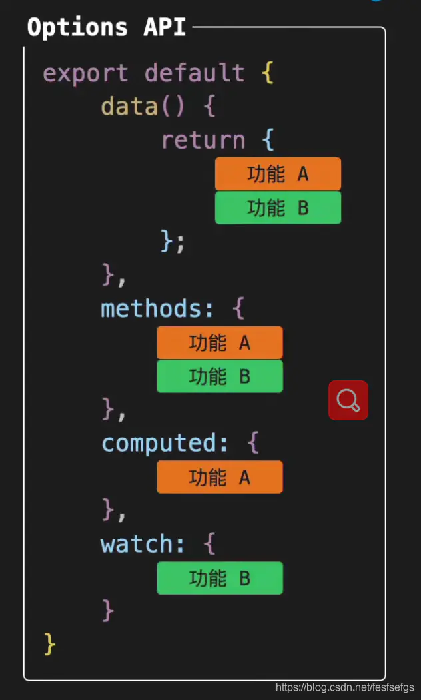
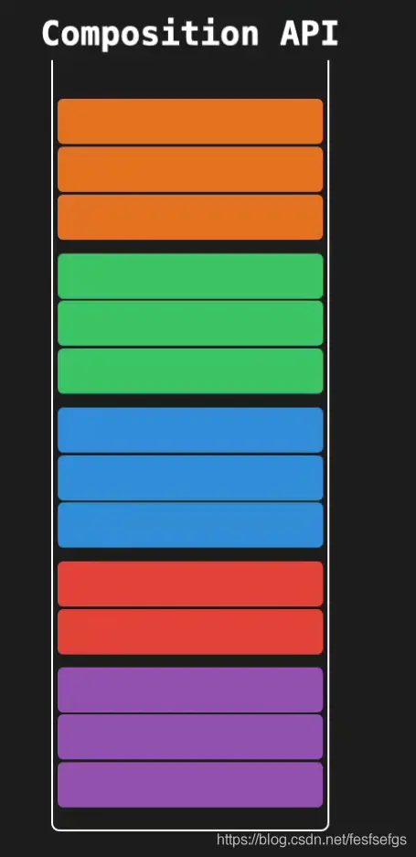
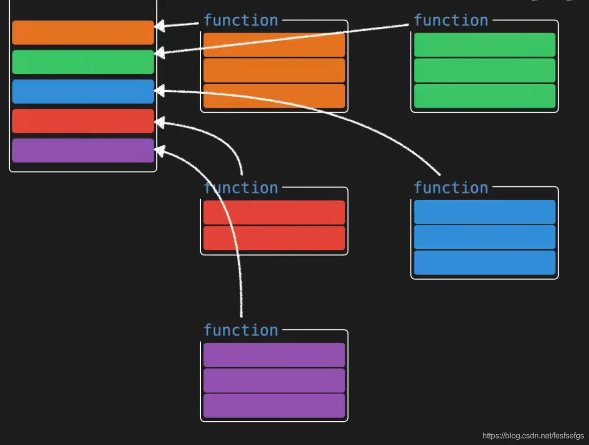
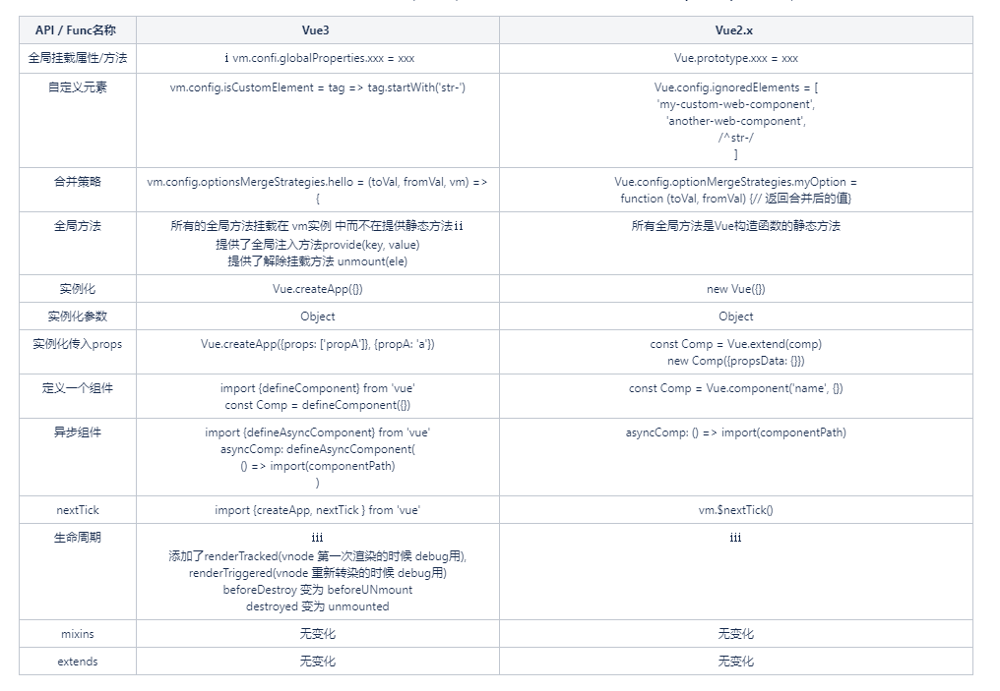
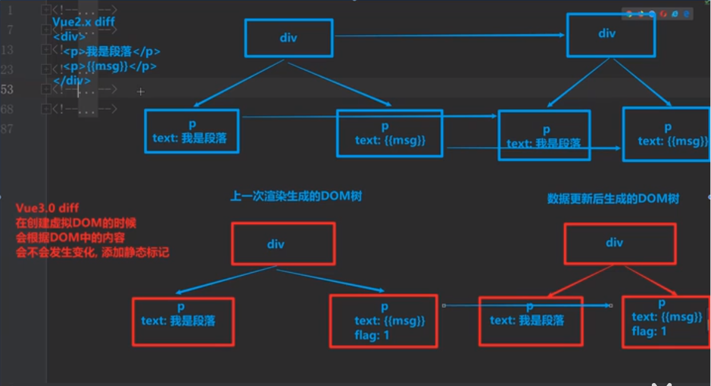

# learn-vue

# 使用vue-cli创建一个项目

安装
```
npm install -g @vue/cli
# OR
yarn global add @vue/cli
```

安装成功之后检查其版本是否正确

```
vue --version
```

运行以下命令来创建一个新项目
```
vue create learn-vue
```

运行
```
cd learn-vue
npm run serve
```

# Vue简介
## 什么是Vue
Vue.js是一套构建用户界面的框架，它不仅容易上手，还可以与其他第三方库整合（Swiper, Iscroll, Echarts）

### 框架与库的区别
框架：是一套完整的解决方案；对项目的“侵入性”较大，项目如果需要更换框架，则需要重构整个项目。

库（插件）：
提供某一个小功能，对项目的“侵入性”较小，如果某个库无法完成某些需求，可以很容易切换到其他库实现。  
例如：从jquery切换到zepto, 无缝切换；从Iscroll切换到ScrollMagic, 只需要将用到Iscroll的代码替换成ScrollMagic即可。

### 为什么学习框架
提升开发效率；  
前端开发提高开发效率的发展历程：原生JS -> jquery之类的类库 -> 前端模版引擎 -> Vue/react/angular

### 框架有很多，为什么要先学Vue
Vue、Angular、React一起，被称为前端三大主流框架。    

但是Angular、React都是老外编写的，所有的资料都是英文的，而Vue是国人编写的，所以所有的资料都是中文的，并且Vue中整合了Angular、React中的众多优点，所以为了降级难度，先学习Vue。


### 使用Vue有哪些优势
1. 通过数据驱动界面更新，无须操作dom来更新界面  
使用Vue我们只需要关心如何获取数据、处理数据、编写业务代码，
我们只需要将处理好的数据交给Vue, Vue就会自动将数据渲染到模板中（界面上）

2. 组件化开发
我们可以将网页拆分为一个个独立的组件来编写，将来再通过封装好的组件拼接成一个完整的网页


# Vue数据单向传递
## MVVM设计模式
在MVVM设计模式中由3个部分组成
M: Model 数据模型（保存数据，处理数据业务逻辑）  
V: View 视图（展示数据，与用户交互）  
VM: View Model  数据模型和视图的桥梁(M是中国人，V是美国人，VM就是中间的翻译)  

MVVM设计模式最大的特点就是支持数据的双向传递    
数据可以从 M -> VM -> V  
也可以从 V -> VM -> M  

## Vue中MVVM的划分
Vue其实是基于MVVM设计模式的 
被控制的区域: View    
Vue实例对象：View Model  
实例对象中的data: Model  

## Vue中数据的单向传递
我们把“数据”交给“Vue实例对象”，Vue实例对象将数据交给“界面”。  
Model -> View Model -> View  

## Vue数据双向绑定

### vue调试工具
[vue调试工具]-Vue.js devtools

如果能打开谷歌应用商店，直接在线安装即可  
[Vue.js devtools](https://chrome.google.com/webstore/detail/vuejs-devtools/nhdogjmejiglipccpnnnanhbledajbpd)

如果无法打开谷歌应用商店，可以离线安装
[Vue.js devtools_v5.3.0](https://www.chromefor.com/vue-js-devtools_v5-3-0/)  
[chrome离线安装vuejs devtools扩展方法](https://blog.csdn.net/HH775313602/article/details/96991523)

编辑Vue.js devtools里的data,页面上的数据也会改变

### 双向绑定
默认情况下Vue只支持数据单向传递M - VM - V
但是由于Vue是基于MVVM设计模式的，所以也提供了双向绑定的能力
在`<input>`、`<textarea>`及`<select>`元素上可以用v-model指令创建双向数据绑定，它会根据控件类型自动选取正确的方法来更新元素。

注：v-model会忽略所有表单元素的value、checked、selected特性的初始值，而总是将Vue实例的数据作为数据源，应该通过 JavaScript 在组件的 data 选项中声明初始值。
v-model 在内部为不同的输入元素使用不同的 property 并抛出不同的事件：

- text 和 textarea 元素使用 value property 和 input 事件
- checkbox 和 radio 使用 checked property 和 change 事件
- select 字段将 value 作为 prop 并将 change 作为事件

[表单输入绑定](https://cn.vuejs.org/v2/guide/forms.html)

### 双向绑定原理
前置技术点
- 数组reduce方法  
    应用场景：下次操作的初始值，依赖于上次操作的返回值
    - 数值的累加计算
    - 链式获取对象属性的值

- 发布订阅模式
    - Dep类：负责进行依赖收集（收集订阅和发布订阅）
      - 首先有个数组，专门来存放所有的订阅信息-收集订阅
      - 其次，还要提供一个向数组中追加订阅信息的方法
      - 然后，还要提供一个循环，循环触发数组中的每个订阅信息-发布订阅
    - Watcher类：负责订阅一些事件

- 使用Object.defineProperty()进行数据劫持（拦截取值、赋值操作）
    - 通过get()劫持取值操作
    - 通过set()劫持赋值操作


# 简介
- vue3首先是向下兼容，Vue3 支持大多数 Vue2 的特性。
- 性能的提升，每个人都希望使用的框架更快，更轻。Vue3 做到了，给开发者一个极致的体验。官方网站给出的数据是：打包大小减少 41%，初次渲染快 55%，更新快 133%，内存使用减少 54%
- 新增 Composition API-组合API（类似React Hooks）
- 单独功能可以抽离, 取代了mixin, 优于mixin 解决上下反复横跳
- 更好的Ts支持
- ...

**不足：**  
- 3.0兼容IE12以上，目前不支持IE11（官方有说明，后续会出一个兼容IE11的版本）
- 项目生态中的几个库都面临巨大升级，以及升级后的诸多坑要填，比如：vue-router、vuex、ElementUI/ViewUI/AntDesignVue 等。这些生态在 2.x 上都已经很成熟，但是在 3.x 上还有很多长路要走，很多坑要踩。
- Vue3.x 没有了默认对象 export default，当前项目中所有直接使用 Vue.xxx 的语法全部得重写，有些都已经沉淀到公司底层库中了，这刀子动起来风险可不小。
- vue3 ssr的文档尚未发布
- ...


**vue2/vue3转化**   
vue3最大改变就是新增compostionApi，你的这个问题可以反过来想。如果你想在vue2基础上使用vue3的新特性，可以独立引入对应的包，比如：@vue/composition-api。但是如果想在vue3的项目上跑vue2，那就需要改一些代码，比如全局的Vue被 createApp(App) 实例替代

**composition api 可以和 options API 同时存在**  
在vue2中如何组织代码的，我们会在一个vue文件中methods，computed，watch，data中等等定义属性和方法，共同处理页面逻辑，（特定的区域写特定的代码，随着业务复杂度提高，会导致后续维护复杂、复用性不高），我们称这种方式为Options API。  
缺点： 一个功能往往需要在不同的vue配置项中定义属性和方法，比较分散，项目小还好，清晰明了，但是项目大了后，一个methods中可能包含20多个方法，你往往分不清哪个方法对应着哪个功能。
  

vue3中的Composition API就是用来解决这个问题的。  
在vue3 Composition API 中，我们的代码是根据逻辑功能来组织的，一个功能所定义的所有api会放在一起（更加的高内聚，低耦合），这样做，即时项目很大，功能很多，我们都能快速的定位到这个功能所用到的所有API，而不像vue2 Options API 中一个功能所用到的API都是分散的，需要改动功能，到处找API的过程是很费劲的。

一个功能所定义的所有api会放在一起:      




**为什么要使用 Composition API：**  
Composition API 是根据逻辑相关性组织代码的，提高可读性和可维护性  
基于函数组合的 API 更好的重用逻辑代码（在vue2 Options API中通过Mixins重用逻辑代码，容易发生命名冲突且关系不清）  

- vm = Vue.createApp({}) || new Vue({}) Vue实例化对象  
- 全局方法 component directive mixin mount use provide  
- 生命周期 beforeCreate, created, beforeMount, mounted, beforeUpdate, updated, activated, deactivated, beforeDestroy, destroyed,errorCaptured  



**Vue3 中 router 带来了哪些变化？**
[Vue3 中 router 带来了哪些变化？](https://zhuanlan.zhihu.com/p/140400374)

构建选项 mode    
由原来的 mode: "history" 更改为 history: createWebHistory()。（设置其他 mode 也是同样的方式）。  
```
// vue2-router
const router = new VueRouter({
  mode:  history ,
  ...
})

// vue-next-router
import { createRouter, createWebHistory } from  vue-next-router
const router = createRouter({
  history: createWebHistory(),
  ...
})
```


[Vue Router: A Tutorial for Vue 3](https://www.vuemastery.com/blog/vue-router-a-tutorial-for-vue-3/)
```
$ npm i vue-router@next
```

/router/index.js
```
import { createWebHistory, createRouter } from "vue-router";
import Home from "@/views/Home.vue";
import About from "@/views/About.vue";

const routes = [
  {
    path: "/",
    name: "Home",
    component: Home,
  },
  {
    path: "/about",
    name: "About",
    component: About,
  },
];

const router = createRouter({
  history: createWebHistory(),
  routes,
});

export default router;
```

/src/main.js
```
import { createApp } from 'vue'
import App from './App.vue'
import router from './router' // <---

createApp(App).use(router).mount('#app')
```


# 目录
[安装](./books/install.md)

# vue3如何变快的
1. vue2中虚拟dom是进行全量的对比, vue3增加了静态标记（Patch Flag）  
  在与上次虚拟节点进行对比时，只对比带有patch flag的节点，并且可以通过flag的信息得知当前节点要对比的具体内容

  
2. hoistStatic 静态提升
  - vue2中无论元素是否参与更新，每次都会重新创建
  - vue3中对于不参与更新的元素，只会被创建一次，之后会在每次渲染时候被不停的复用

    ```html
    <div>
      <p>我是段落1</p>
      <p>我是段落2</p>
      <p>我是段落3</p>
      <p>{{msg}}</p>
    </div>
    `` 

3. cacheHandlers 事件侦听器缓存
  - 默认情况下onClick会被视为动态绑定，所以每次都会追踪它的变化，但是因为是同一个函数，所以没必要一直追踪变化，直接缓存复用即可

  ```html
  <div>
    <button @click="onClick">按钮</button>
  </div>
  ```
  ```js
  export function render(_ctx, _cache, $props, $setup, $data, $options) {
  return (_openBlock(), _createBlock("div", null, [
      _createVNode("button", { onClick: _ctx.onClick }, "按钮", 8 /* PROPS */, ["onClick"])
    ]))
  }
  ```
  开启事件侦听器缓存后：     
  转换后的代码，可能看不太懂，但是不要紧；  
  只需要观察有没有静态标记即可；   
  因为在vue3的diff算法中，只有有静态标记的才会进行比较，进行跟踪变化.
  ```js
  export function render(_ctx, _cache, $props, $setup, $data, $options) {
  return (_openBlock(), _createBlock("div", null, [
    _createVNode("button", {
      onClick: _cache[1] || (_cache[1] = (...args) => (_ctx.onClick && _ctx.onClick(...args)))
    }, "按钮")
  ]))
  ```

4. ssr渲染
- 当有大量静态的内容时，这些内容会被当做纯字符串推进一个buffer里，即使存在动态的绑定，会通过模块插值嵌入进去。这样会比通过虚拟dom来渲染快很多
- 当静态内容大到一定量级时，会用_createStaticVNode方法在客户端去生成一个static node,
这些静态node，会被直接innerHtml,就不需要创建对象，然后根据对象渲染


# vue在线编译网址
vue2.xx版本在线编译: https://template-explorer.vuejs.org/

vue3.xx版本在线编译: https://vue-next-template-explorer.netlify.app/

代码片段1
```html
<div>
  <p>我是段落1</p>
  <p>我是段落2</p>
  <p>我是段落3</p>
  <p>{{msg}}</p>
</div>
``


# PatchFlag附录

TEXT = 1, 动态文本节点  
CLASS = 2, 动态class  
STYLE = 4, 动态 style  
PROPS = 8, 动态属性，但不包含类名和样式  
FULL_PROPS = 16, 具有动态的Key属性，当Key改变时，需要进行完整的 diff 比较  
HYDRATE_EVENTS = 32, 带有监听事件的节点  
STABLE_FRAGMENT = 64, 一个不会改变子节点顺序的 fragment  
KEYED_FRAGMENT = 128, 带有key属性的 fragment 或部分子字节有 key  
UNKEYED_FRAGMENT = 256, 子节点没有 key 的 fragment  
NEED_PATCH = 512, 一个节点只会进行非 props 比较  

```html
<div>
  <p>我是段落1</p>
  <p>我是段落2</p>
  <p>我是段落3</p>
  <p>{{msg}}</p>
</div>
```
```js
export function render(_ctx, _cache, $props, $setup, $data, $options) {
  return (_openBlock(), _createBlock("div", null, [
    _createVNode("p", null, "我是段落1"),
    _createVNode("p", null, "我是段落2"),
    _createVNode("p", null, "我是段落3"),
    _createVNode("p", null, _toDisplayString(_ctx.msg), 1 /* TEXT */)
  ]))
}
```


# vue3.x兼容vue2.x     
vue2 todoList  
vue2实现一项功能需要先在data里定义一份数据，然后在methods或computed或watch里写上对应的功能逻辑，才可以完成某项功能。
这种方式数据和业务逻辑分散，不利于管理和维护，vue3为了解决这个现象，推出了组合API.

# 组合API
注意点：      
在组合API中定义的变量/方法，要想在外界使用，必须通过return{xxx, xxx}暴露出去.

setup函数-组合API的入口函数
```
export default {
  name: "",
  setup() {
  
  } 
}
```  

定义变量
```
let count = ref(0);
```

定义方法
```
function increment() {
  console.log('count', count);
  count.value++;
}
```

# 创建实例并且挂载DOM上
2.x
```
import Vue from "vue";
import App from './App.vue'
  
new Vue({
  render: (h) => h(App)
}).$mount("#app");
```

3.x - 新增api===>createApp创建实例    
createApp 会产生一个 app 实例，该实例拥有全局的可配置上下文

```
import { createApp } from 'vue'
import App from './App.vue'
  
createApp(App).mount('#app')
```

# unmount【新增属性】
在所提供的DOM元素上卸载应用程序实例的根组件

```
import { createApp } from 'vue'

const app = createApp({})
// 做一些必要的准备
app.mount('#my-app')

// 应用程序将在挂载后5秒被卸载
setTimeout(() => app.unmount('#my-app'), 5000)
```

# setup
setup 函数是一个新的组件选项。作为在组件内使用 Composition API 的入口点  
this 在 setup() 中不可用。由于 setup() 在解析 2.x 选项前被调用，setup() 中的 this 将与 2.x 选项中的 this 完全不同。同时在 setup() 和 2.x 选项中使用 this 时将造成混乱.
```
export default {
  props: {
    name: String,
  },
  setup(props) {
    console.log(props.name)
     watchEffect(() => {
      console.log(`name is: ` + props.name)
    })
  },
}
```

# 响应式API  
reactive    
接收一个普通对象然后返回该普通对象的响应式代理【等同于 2.x 的 Vue.observable()】 
```
function useMousePosition() {
    const pos = reactive({
        x: 0,
        y: 0,
      })
    return pos
}
```

ref  
接受一个参数值并返回一个响应式且可改变的 ref 对象。ref 对象拥有一个指向内部值的单一属性 .value

```
const count = ref(0)
console.log(count.value) // 0
```


# 双向绑定 v-model
- 重大变更：在自定义组件上使用 v-model 时，属性以及事件的默认名称变了：

  属性：value => modelValue
  事件：input => update:modelValue

  2.x
  ```
  <ChildComponent v-model="pageTitle" />

  <!-- 是以下代码的简写： -->

  <ChildComponent :value="pageTitle" @input="pageTitle = $event" />
  ```

  3.x
  ```
  <ChildComponent v-model="pageTitle" />

  <!-- 是以下代码的简写： -->

  <ChildComponent
    :modelValue="pageTitle"
    @update:modelValue="pageTitle = $event"
  />

  ```

- 重大变更：v-bind 的 .sync 修饰符和组件的 model 选项被干掉了，取而代之的是 v-model 参数

2.x
```
<ChildComponent :title.sync="pageTitle" />
```

要修改一个model的名称的话，现在我们可以给 v-model 传递一个 参数 以取代此前的 model 选项：  
3.x 
```
<ChildComponent v-model:title="pageTitle" />

<!-- 是以下代码的简写： -->

<ChildComponent :title="pageTitle" @update:title="pageTitle = $event" />

```
这也可以代替 .sync 修饰符，并且现在我们可以在自定义组件上使用多个 v-model 了。
```
<ChildComponent v-model:title="pageTitle" v-model:content="pageContent" />

<!-- 是以下代码的简写： -->

<ChildComponent
  :title="pageTitle"
  @update:title="pageTitle = $event"
  :content="pageContent"
  @update:content="pageContent = $event"
/>

```


- 新特性： 支持同一组件同时设置多个 v-model
- 新特性：支持开发者自定义 v-model 修饰符


# 计算属性
2.x的计算属性
```
<script>
export default {
    data() {
        return {
            firstName: '黑'，
            lastName: '嘿黑'
        }
    },
    computed:{
        fullName: function() {
            return this.firstName + this.lastName
        }
    },
    ...
}
</script>
```

3.0中的计算属性
```
<script>
import {ref, computed} from 'vue'

export default {
    setup() {
        let firstName = ref('黑')
        let lastName = ref('嘿黑')
        
        let fullName = computed(() => {
            return firstName + lastName
        })
        
        return {
            firstName，
            lastName，
            fullName
        }
    }
}
</script>
```

# 监听 watch
2.x 中的 wath
```
//html
<template>
  <div class="hello">
    <div>{{message}}</div>
    <div class="message">{{changeMessage}}</div>
    <button @click="handleMessage">Bless God</button>
  </div>
</template>

<script>
export default {
    data() {
         message: 'have no girlfriend',
         changedMessage: 'click the bottom btn will have a girlfriend!'
    },
    watch:{
        message: {
            handler: function(newVal, oldVal) {
                this.changedMessage = newVal
            }
        }
    },
    
    methods:{
    handleMessage: function(){
        message.value =  'lied to you'
        }
    },
    ...
    
}
</script>
```

3.0中的 watch
```
//html
...
<script>
import { ref,watch, watchEffect } from 'vue'

export default {
    ...,
    setup() {
        let message = ref('have no girlfriend')
        let changeMessage = ref('click the bottom btn will have a girlfriend!')
        
        // simple effect
        watchEffect(()=> {
          changeMessage.value = message.value  
        })
        
        watch(message,(newVal,oldVal) => {
          changeMessage.value = newVal
        })
        
        // method
        const handleMessage = function(){
          message.value =  'lied to you'
        }
        return {
          message,
          handleMessage,
          changeMessage
        }
    }
}
</script>
```

# 生命周期
2.x和3.0的生命周期函数使用方式都是一致，这里只举例 onMounted这一个函数。  

2.0 中的 mounted
```
<script>
export default {
    ...,
    mounted() {
        // do some thing
    }
}
</script>
```

3.0中的 onMounted
```
<script>
import { onMounted } from 'vue'
export default {
    setup() {
        onMounted(() => {
            // do some thing
        })
    }
}
</script>

```

# 如何获取DOM元素

2.x中获取DOM元素
```
//hmtl
<template>
    <div ref="root">
        test message
    </div>
</template>

<script>
export default {
    ...,
    mounted() {
       let root = this.$refs.root
    },
    ...
}
</script>
```

3.x中获取DOM元素
```
//hmtl
<template>
    <div ref="root">
        test message
    </div>
</template>

<script>
import { ref,onMounted } from 'vue'

export default {
    ...,
    setup() {
        let root = ref(null)
        onMounted(() => {
            let rootEle = root.value
        })
        
        return {
            root
        }
        
    }
    ...
}
</script>
```

# 过滤器 Filters
完全移除Filters;  
2.x
```
<template>
  <h1>Bank Account Balance</h1>
  <p>{{ accountBalance | currencyUSD }}</p>
</template>

<script>
  export default {
    props: {
      accountBalance: {
        type: Number,
        required: true,
      },
    },
    filters: {
      currencyUSD(value) {
        return '$' + value;
      },
    },
  };
</script>
```

3.x中使用计算属性或者自定义方法处理
```
<template>
  <h1>Bank Account Balance</h1>
  <p>{{ accountInUSD }}</p>
</template>

<script>
  export default {
    props: {
      accountBalance: {
        type: Number,
        required: true,
      },
    },
    computed: {
      accountInUSD() {
        return '$' + this.accountBalance;
      },
    },
  };
</script>
```


# 参考资料
- [Vue3中文文档 - vuejs](https://vue3js.cn/docs/zh/guide/installation.html#%E5%8F%91%E5%B8%83%E7%89%88%E6%9C%AC%E8%AF%B4%E6%98%8E)  
- [vue3-News](https://github.com/vue3/vue3-News)
- [Vue 3.X 带来的新变化](https://lkangd.com/post/new-for-vue-3/)
- [Vue3 SSR 服务端渲染调研](https://www.jianshu.com/p/985710f937c3)


# vue2和vue3区别
...


# 参考资料
- [Exploring Vue.js: Reactive Two-Way Data Binding](https://medium.com/js-dojo/exploring-vue-js-reactive-two-way-data-binding-da533d0c4554)

- [Analyze the principle of Vue and realize two-way binding MVVM
](https://programmer.help/blogs/analyze-the-principle-of-vue-and-realize-two-way-binding-mvvm.html)

- [defineProperty](https://developer.mozilla.org/zh-CN/docs/Web/JavaScript/Reference/Global_Objects/Object/defineProperty)

- [Vue.js作者尤雨溪谈 Vue 3.0 进展_VueConf CN 2019
](https://www.youtube.com/watch?v=AnoZheeH0Nk)


